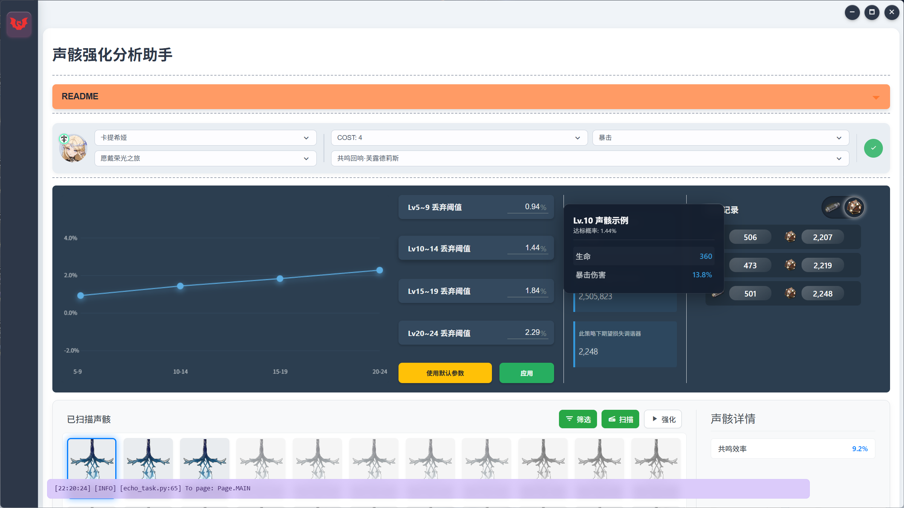

<div align="center">
  
  <h1 align="center">Wuthering Waves Toolbox</h1>
  <h2 align="center">

    English | [中文](./README_CN.md)
    
  </h2>
</div>

Welcome to Wuthering Waves Toolbox, a handy CV-based toolset aiming at providing holistic, rigorous analysis and automation to help you better understand your in-game statistics. 

Wuthering Waves Toolbox is still under intense developing. Currently, it integrates customizable echo analysis and echo scan&upgrade automation, which adopts the optimal strategy to reduce the wasted resources.



## 💻 Installation

We only support Windows(x86) so far considering that most users prefer playing WW on Windows other than other platforms.

### Prerequisites

- Python (3.8 or newer, we recommend 3.11)
- [Node.js](https://nodejs.org/en) (which includes npm)
- [Visual Studio Build Tools](https://visualstudio.microsoft.com/visual-cpp-build-tools/) (make sure to select "Desktop development with C++").
- (Optional) Install [CUDA](https://developer.nvidia.com/cuda-12-6-0-download-archive?target_os=Windows&target_arch=x86_64&target_version=11&target_type=exe_local) for gpu acceleration.

### Setup

1.  **Clone the repository:**
    ```bash
    git clone git@github.com:PlanarG/ww-toolbox.git
    cd ww-toolbox
    ```

2.  **Set up the Python backend:**
    We recommend to use `conda` to create a virtual environment to manage dependencies.

    ```bash
    # Create a virtual environment
    conda create -n ww-toolbox python=3.11

    # Activate the virtual environment
    conda activate ww-toolbox

    # Install dependencies
    pip install -r requirements.txt

    # Check Python dependencies installation and build C++ interfaces
    pip install -e .
    ```

3.  **Set up the Electron frontend:**
    ```bash
    # Navigate to the frontend directory
    cd frontend

    # Install Node.js dependencies
    npm install
    ```

4.  **Run the application:**
    Once both the backend and frontend are set up, you can start the application in the `./frontend` directory.

    ```bash
    # From the frontend directory
    npm start .
    ```
    The application will launch with administrator privileges and start the Python backend in the background since it requires administration to take screenshots of the game.

## 📖 Documentation

Coming soon

## 📜 License

Wuthering Waves Toolbox is distributed under the MIT License. See [`LICENSE`](./LICENSE) for more information.